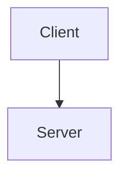
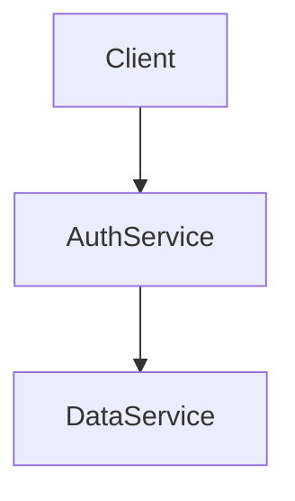
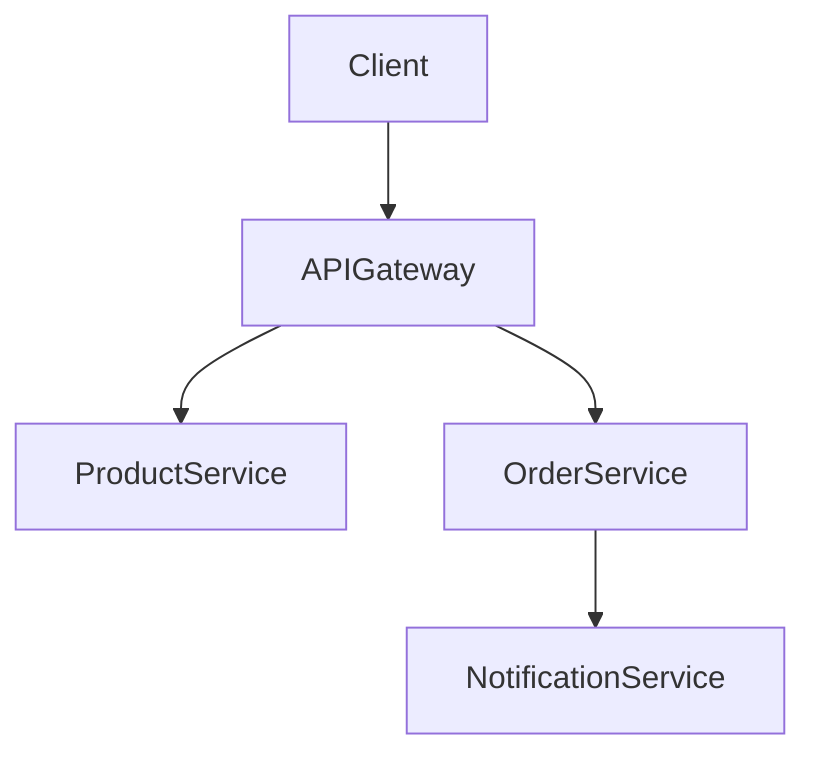

# P3_WSE_230104040119
Praktikum 3 Web Service Architecture

# Praktikum 3 – Web Service Architecture

Nama  : Amilia Zannahtul Putria  
NIM   : 230104040119  
Mata Kuliah : Web Service Engineering  

---

## Tujuan Praktikum
Praktikum ini bertujuan untuk memahami konsep dan perbedaan arsitektur Web Service, yaitu Client–Server, Service Oriented Architecture (SOA), dan Microservices, serta menganalisis karakteristik masing-masing arsitektur.

---

## Arsitektur Client–Server
Arsitektur Client–Server merupakan model arsitektur di mana client mengirimkan request langsung ke server. Server bertanggung jawab penuh dalam pemrosesan data dan pengiriman response kepada client. Arsitektur ini sederhana dan mudah diimplementasikan, namun memiliki keterbatasan pada skalabilitas karena server menjadi pusat sistem.

---

## Service Oriented Architecture (SOA)
Service Oriented Architecture (SOA) membagi sistem menjadi beberapa service yang saling berkomunikasi. Setiap service memiliki fungsi tertentu dan dapat digunakan kembali oleh service lain. Pendekatan ini membuat sistem lebih modular dibandingkan Client–Server, namun memiliki kompleksitas integrasi yang lebih tinggi.

---

## Microservices
Arsitektur Microservices memecah aplikasi menjadi layanan-layanan kecil yang berdiri sendiri. Setiap layanan dapat dikembangkan, dijalankan, dan di-deploy secara mandiri. Arsitektur ini sangat cocok untuk sistem berskala besar karena mendukung fleksibilitas dan skalabilitas tinggi, meskipun membutuhkan pengelolaan yang lebih kompleks.

---

## Diagram Arsitektur

### Diagram Client–Server

### Diagram Service Oriented Architecture (SOA)

### Diagram Microservices

---

## Analisis Perbandingan

| Arsitektur | Kelebihan | Kekurangan |
|-----------|-----------|------------|
| Client–Server | Mudah diimplementasikan dan sederhana | Server menjadi single point of failure |
| SOA | Modular dan service dapat digunakan kembali | Kompleksitas integrasi antar service |
| Microservices | Skalabilitas tinggi dan fleksibel | Monitoring dan manajemen lebih kompleks |

---

## Kesimpulan
Berdasarkan hasil praktikum, dapat disimpulkan bahwa setiap arsitektur Web Service memiliki karakteristik masing-masing. Pemilihan arsitektur harus disesuaikan dengan kebutuhan dan skala sistem. Client–Server cocok untuk sistem sederhana, SOA cocok untuk sistem terintegrasi, dan Microservices paling sesuai untuk sistem modern berskala besar.
